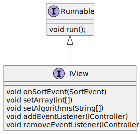
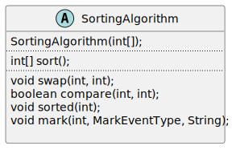

# Development
The software can be extended in multiple ways, which are described in this document.

## Add a new user interface
In order to add a new user interface, a newly created class needs to implement the __IView__ interface.  
The methods that need to be implemented and their intended function is described in the source code.  
All views also implement the __Runnable__ interface, so that they can be run in their own thread.



Afterward, the view can be used with the existing controller and sorting algorithms.

## Add a new sorting algorithm
A new sorting algorithm can be added to the software in 4 steps.

### 1) Creating a new class
All sorting algorithms inherit from the __SortingAlgorithm__ class and are located in the __sorting__ package.  
  
After inheriting from this class, a method called _sort_ needs to be implemented.
This is where the sorting algorithm can be coded.

### 2) Coding the sorting algorithm
The sort needs to be performed on the _array_ attribute present in the parent class.  
After the sorting is complete, the method should return the sorted array.

### 3) Add sorting events to the algorithm
Methods to generate the sorting events for the view are provided by the __SortingAlgorithm__ class.  
These need to be called in appropriate locations in the sorting algorithm code to signal the current step to the view.

#### void swap(a, b)
Indicate that two elements are being swapped
```
swap(a, b);
int temp = array[a];
array[a] = array[b];
array[b] = temp;
```

#### boolean compare(a, b)
Indicate that two elements are being compared.
Returns a boolean (always true) so that it can be used in line.
Be mindful of short circuit evaluation.
```
compare(a, b);
if(array[a] > array[b]) {
    ...
}
```
```
if(compare(a, b) && array[a] > array[b]) {
    ...
}
```

#### void sorted(a)
Signals that the element at index a has been sorted.
```
for(int i = 0; i < n; i++) {
    for(int j = 0; j < n; j++) {
        // Sort element at index i
    }
    sorted(i);
}
```

### void highlight(a, message)
Highlights the element at index a with a message.
```
void quicksort(int[] array, int start, int stop) {
    int pivot = partition(array, start, stop)
    
    hightlight(pivot, "Array partitioned around pivot element");
    
    quicksort(array, start, pivot - 1);
    quicksort(array, pivot + 1, stop);
}
```

#### void mark(a, markEventType, message)
Marks the element at index a with message that can be displayed.  
This is internally used to mark an element as sorted. Valid mark event types are recorded in the __MarkEventType__ enum.  
```
void quicksort(int[] array, int start, int stop) {
    int pivot = partition(array, start, stop)
    
    mark(pivot, MarkEventType.Highlight, "Array partitioned around pivot element");
    
    quicksort(array, start, pivot - 1);
    quicksort(array, pivot + 1, stop);
}
```

### 4) Register the algorithm
After the algorithm is implemented it needs to be registered in the software.  
This is done using the __AlgorithmList__ class in the __controller__ package.  
The software will only use algorithms listed in the _algorithms_ array found in this class.  
A new algorithm can be added using the following template.

```
new AlgorithmData(){{
    name = "[Display name of the algorithm]";
    classType = [NewSortingAlgorithm].class;
}}
```