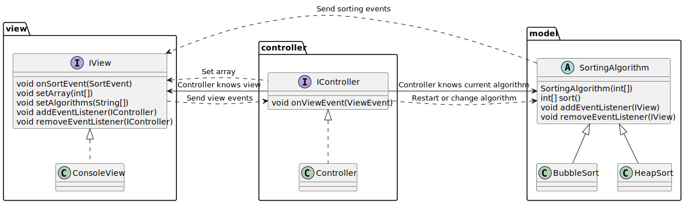
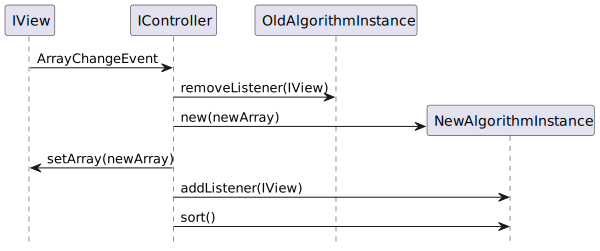
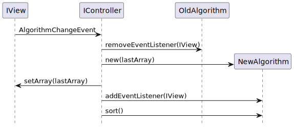

# Overview
This documentation provides an overview of how the software works internally.

## MVC design

The software is modeled after the MVC design pattern with the components located in the respective packages.  

In order for the model to communicate with the view, the sorting algorithms generate sorting events.

These events are sent to the view, which then processes them. An important event is the swap event,
which indicates that the sorting algorithm swapped two elements in the array.
The view uses this information to recreate the steps taken by the algorithm.
That way, the view does not need to know which exact algorithm is performed and model and view are separated.  

The view can also generate events, used to communicate user input to the controller.
This includes events like choosing a new array or changing the algorithm used.

The controller manages the view and the model and makes sure that the view is listening to events from the currently used algorithm.
It also responds to events from the view. The handling of these events is described in the images below.

This image shows how an array change event is processed by the controller.

This image shows how an algorithm change event is processed by the controller.